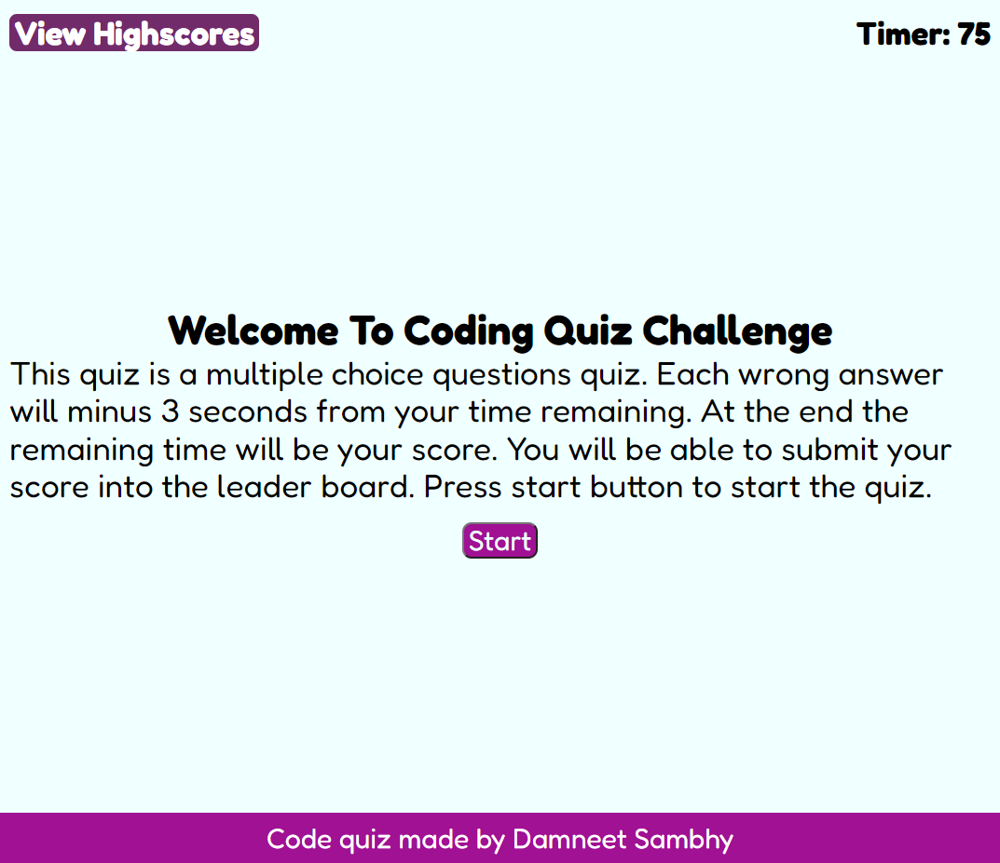

# Code Quiz

## Goal
Design and develop a timed Javascript multiple-choice quiz

## Website URL
https://daman29.github.io/Code-Quiz/

Link above takes you to the webpage.

## Description

- Designed and developed a Javascript coding quiz
- Multiple-choice questions with time control
- Stores high scores of all players with initials
- Start button to start the quiz and timer
- Questions are displayed on screen with all available options
- When the question is answered incorrectly the user is punished with a time penalty
- When the question is answered correctly the next question is displayed with choices
- This happens until either all 10 questions are answered correctly or the time runs out
- When the game is over it gives you a chance to save your score and compare yourself on the leader board
- Options available to clear the leader board

## Damneet's Coding Quiz
Below is the screen capture of the webpage.

---

## Bonus
- Questions are chosen in a random order to keep the user on their toes